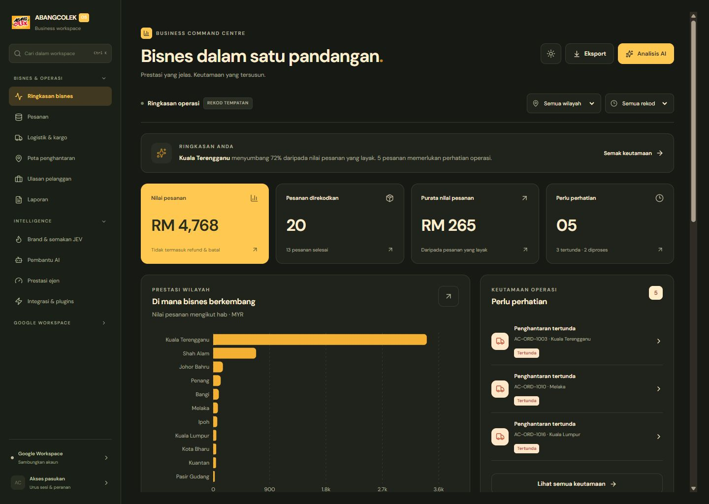

# Dashboard UI/UX — Implementasi

Tarikh: 1 Oktober 2026

Dashboard aplikasi telah disusun semula menjadi **Business Command Centre**, dengan fokus pada prestasi bisnes dan tindakan operasi.

## Perubahan

- Dashboard sebagai halaman awal aplikasi.
- Ringkasan wilayah utama dan jumlah pesanan yang perlukan perhatian.
- Empat KPI interaktif dengan drill-through kepada rekod asal.
- Carta nilai pesanan wilayah dan donut status fulfillment.
- Queue pesanan tertunda/diproses, serta pintasan semakan JEV.
- Jadual pesanan dengan carian, tab status, detail dan eksport CSV.
- Filter wilayah dan tempoh yang berfungsi pada keseluruhan ringkasan.
- Light/dark mode dengan pilihan tema disimpan secara tempatan.
- Sidebar berkelompok dan navigation mobile empat tab + akses semua 18 modul.
- Dashboard analitik lama/hasil ejen dikekalkan dalam bahagian boleh dibuka.

## Fail utama

- `src/features/dashboard/DashboardView.tsx`: susunan halaman dan interaksi.
- `src/features/dashboard/dashboard.css`: tokens dan responsive styles.
- `src/features/dashboard/model.ts`: filter/pengiraan metrik.
- `src/components/WorkspaceSidebar.tsx`: navigation desktop dan menu mobile berkongsi kumpulan modul.
- `src/components/workspace-sidebar.css`: shell/sidebar styles.
- `src/App.tsx`: wiring halaman dan navigation.
- `tests/dashboard-model.test.ts`: metric reconciliation, filter dan empty data.

Firebase JSON yang hilang dan initialization Gemini tanpa key menyebabkan aplikasi blank. Prasyarat ini dibaiki dengan optional public Firebase configuration dan lazy Gemini initialization; tiada credential contoh dimasukkan.

## Bukti

[Desktop cerah](dashboard-ui/desktop-light.png) · [Mobile](dashboard-ui/mobile-light.png) · [Design QA](../design-qa.md)

Typecheck dan build lulus. Tiga unit tests lulus. Filter Johor Bahru dibuktikan menghasilkan RM155 daripada empat rekod yang sama dalam detail. Escape/focus, carian, empty state, tema dan navigation mobile juga disemak pada browser.

Data halaman utama berasal daripada seed contoh dan rekod tempatan appStore. Sambungan backend langsung, OAuth dan keputusan JEV rasmi belum disahkan dalam tugas UI ini. Button eksport memberi confirmation; fail download akhir belum dapat diverifikasi melalui browser automation.
