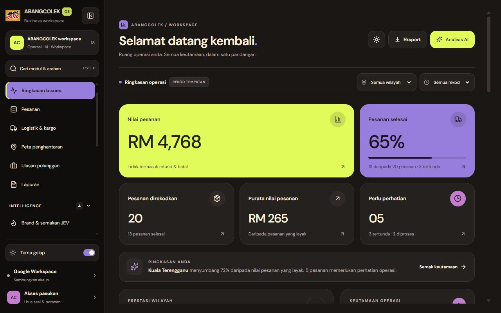

# Pelaksanaan Tema Global dan Sidebar ABANGCOLEK-OS

Tarikh: 2 Oktober 2026. Skop: susulan permintaan supaya seluruh workspace selari dengan tiga imej rujukan pengguna. Status: perubahan source, build dan semakan rendering selesai; integrasi backend bukan skop pengesahan ini.

## 1. Apa yang telah diubah

Tema charcoal, lime, violet dan lilac kini menggunakan token global dalam `src/features/theme/workspace-theme.css`. `useWorkspaceTheme.ts` mengurus tema dark/light, menyimpan pilihan dan memigrasi pilihan dashboard lama. App, dashboard dan sidebar menggunakan state tema yang sama. Typography sedia ada DM Sans dikekalkan; font Mabry Pro dalam rujukan tidak dimasukkan tanpa aset/lesen.

Token membezakan warna permukaan, teks, border, aksen hiasan dan teks aksen. Ini mengelakkan teks violet terang atau lime digunakan tanpa contrast yang sesuai. Status kejayaan, amaran dan kegagalan mempunyai token tersendiri. Logo Google dan gaya map provider kekal sebagai identiti servis.

Komponen operasi, plugin, artifact, chat, laporan, borang, Google Workspace, command palette, peta serta butang sambungan telah diselaraskan. Perubahan ini tidak menukar API, provider atau aturan bisnes.

## 2. Sidebar yang diperbaiki

- Workspace card dengan konteks projek dan jumlah 18 modul.
- Tiga kumpulan: Bisnes & operasi (6), Intelligence (4), Google Workspace (8).
- Kumpulan boleh dibuka/tutup; kumpulan route aktif dibuka secara automatik.
- Expanded sidebar dan icon rail; pilihan collapse disimpan merentas reload.
- Semua route mempunyai accessible label; icon rail mempunyai tooltip.
- Route aktif mempunyai `aria-current="page"` dan dipastikan kelihatan melalui scroll terdekat.
- Carian modul/command palette, kawalan tema global dan disclosure akaun/pasukan.
- Mobile mempunyai pilihan modul, theme toggle dan carian dengan header dua baris pada skrin kecil.

## 3. Liputan rendering

Setiap route di bawah dibuka dalam **dark dan light**: 18 × 2 = 36 semakan rendering. Bukti DOM dan screenshot ialah bukti paparan; ia tidak membuktikan setiap operasi menulis ke servis luaran berjaya.

| Kumpulan | Route yang diperiksa |
|---|---|
| Bisnes & operasi | Dashboard, Pesanan, Logistik & kargo, Peta penghantaran, Ulasan pelanggan, Laporan |
| Intelligence | Brand & semakan JEV, Pembantu AI, Prestasi ejen, Integrasi & plugins |
| Google Workspace | Gmail, Calendar, Tasks, Docs, Sheets, Forms, Meet, Workspace Chat |

Rekod: [global-route-verification.json](dashboard-ui/global-route-verification.json). Screenshot setiap route berada dalam direktori `dashboard-ui/`, dengan awalan `global-dark-` dan `global-light-`.

## 4. Interaksi yang disahkan dalam browser

1. Collapse/expand sidebar dan akses kesemua 18 modul pada rail.
2. Pilihan light dan collapsed bertahan selepas reload.
3. Membuka Gmail dari rail lalu expand membuka kumpulan Google Workspace.
4. Command palette mencari Sheets dan membuka modul Google Sheets.
5. Viewport 320 × 740: Sheets dark, kemudian Gmail light; document width 320px.
6. Theme toggle berfungsi di luar dashboard.
7. Selepas perubahan akhir, Gmail aktif berada dalam viewport nav; kembali dashboard membawa Ringkasan bisnes ke atas kawasan nav.

## 5. Validasi source

| Pemeriksaan | Hasil |
|---|---|
| `bun run lint` (`tsc --noEmit`) | Lulus |
| `bun run build` | Lulus, 2,940 modules |
| `bun test tests/dashboard-model.test.ts` | 3 lulus, 10 assertions, 0 gagal |
| Independent code review | APPROVE, termasuk effect auto-scroll terakhir |

Build akhir menghasilkan CSS 93.29 KB dan JavaScript 2,099.97 KB (gzip 558.83 KB). Vite masih memberi amaran chunk melebihi 500 KB. Code splitting route ialah cadangan susulan; amaran ini belum diselesaikan dalam migrasi tema.

## 6. Bukti visual

- [Sidebar icon rail](dashboard-ui/global-sidebar-rail.png)
- [Mobile Sheets dark](dashboard-ui/global-mobile-sheets-dark.png)
- [Mobile Gmail light](dashboard-ui/global-mobile-gmail-light.png)

## 7. Batas laporan

Data contoh/local dan claim operasi yang telah wujud sebelum migrasi ini tidak disahkan sebagai data produksi. Login Google, penghantaran email, perubahan pesanan, JEV inference, Supabase policy dan pembayaran tidak dijalankan sebagai sebahagian semakan tema. Beberapa paparan bergantung pada loading/data luar. Ini tidak boleh disebut sebagai audit seluruh workflow atau pensijilan WCAG. Semakan contrast, keyboard dan screen reader yang formal masih boleh menjadi gate keluaran berasingan.

Kesimpulan: tema kini dikongsi seluruh 18 route, sidebar mempunyai struktur dan kawalan baharu, dan rendering serta interaksi navigasi yang dinyatakan telah diperiksa secara langsung pada server lokal.
